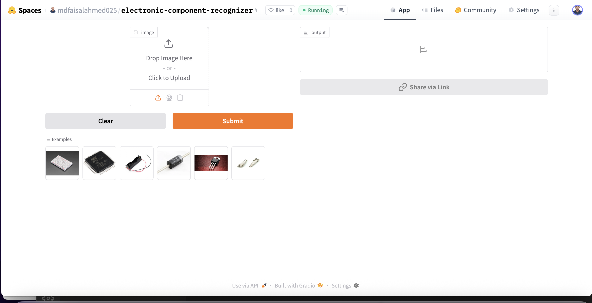

# Electronic Component Recognizer

This project is an end-to-end pipeline for building an image classification system that can recognize and classify electronic components. It covers the entire workflow — from **data collection, data cleaning, training, evaluation, and deployment** to **API integration with a live demo**.

The model is designed to classify **20 different types of commonly used electronic components** in circuits, prototyping, and hardware systems.

### Supported Component Classes

1. Resistor
2. Capacitor
3. Diode
4. Transistor
5. IC Chip
6. Relay
7. Switch
8. Transformer
9. LED
10. Connector
11. Potentiometer
12. Fuse
13. Inductor Coil
14. Crystal Oscillator
15. Heat Sink
16. Breadboard
17. Jumper Wire
18. Battery Holder
19. Power Supply Module
20. Microcontroller Board

---

# Dataset Preparation

Building a reliable dataset was the most challenging and time-consuming part of the project.

- **Data Collection:**  
  Images were collected from online sources (mainly DuckDuckGo Image Search) using component-specific search terms. Each class was carefully named to ensure the model learns the actual characteristics of the component (e.g., _resistor_, _capacitor_, _IC chip_).

- **DataLoader Setup:**  
  The dataset was prepared using the **fastai DataBlock API**, which made it simple to define training and validation splits, apply transformations, and set up the dataloaders for the training pipeline.

- **Data Augmentation:**  
  fastai provides default GPU-based data augmentation such as rotations, zoom, lighting adjustments, and flipping. These augmentations helped improve the robustness of the model and prevented overfitting.

## More details, including preprocessing steps and data inspection, are documented in `notebooks/data_collection_and_pre_proccessing_and_training_latest.ipynb`

# Training and Data Cleaning

- **Model Training:**  
  A **ResNet34** convolutional neural network, pre-trained on ImageNet, was fine-tuned on our dataset. The model was trained for multiple epochs in different cycles, each time improving accuracy and reducing validation loss.

After several iterations, the model achieved **97%** validation accuracy. This demonstrates the model’s robustness and strong generalization capabilities, even when trained on a noisy and diverse dataset

- **Data Cleaning:**  
  Data cleaning was the most time-intensive step. Since the dataset was web-scraped, many irrelevant or noisy images were included (for example, schematic diagrams, logos, or unrelated objects).  
  The **fastai ImageClassifierCleaner** was used after each training cycle to manually review and remove incorrect or misleading samples.  
  This iterative process of _train → clean → retrain_ significantly improved the model’s performance and generalization ability.

---

# Model Deployment

Once the model reached satisfactory performance, it was deployed to **Hugging Face Spaces** using **Gradio**.

- Gradio provides an interactive UI where users can upload an image of an electronic component and instantly receive predictions with confidence scores.
- The deployed model can be accessed here: [HuggingFace Space](https://huggingface.co/spaces/mdfaisalahmed025/electronic-component-recognizer).
- Implementation scripts for deployment can be found in the `deployment` folder.

  

---

# API Integration with GitHub Pages

To make the model more accessible and user-friendly, the deployed Hugging Face API was integrated into a **GitHub Pages website**.

- The GitHub Pages site allows users to upload an image directly from their browser.
- The image is sent to the Hugging Face API endpoint, which returns predictions that are displayed on the page.
- This provides a clean and interactive frontend for the model without requiring users to install anything locally.

🔗 Live Demo: [Electronic Component Recognizer Website](https://mdfaisalahmed025.github.io/Electronic-component-Identifier/)

The website implementation and scripts for API communication can be found in the `docs` and `backend` folder.

---

# Future Work

- Expanding the dataset to include more diverse angles and real-world usage of components.
- Training deeper models like ResNet50 or EfficientNet for improved accuracy.
- Building a mobile-friendly interface for engineers and students to use on-the-go.
- Integrating with hardware learning platforms (e.g., Arduino kits) for real-time recognition.

---

# Conclusion

The **Electronic Component Recognizer** demonstrates the power of transfer learning and end-to-end ML pipelines — from raw data collection to deployment as a usable web application.  
It has applications in **education, prototyping, inventory management, and automated electronic system design**.

This project showcases a practical workflow for turning an idea into a real, user-facing application powered by machine learning.
