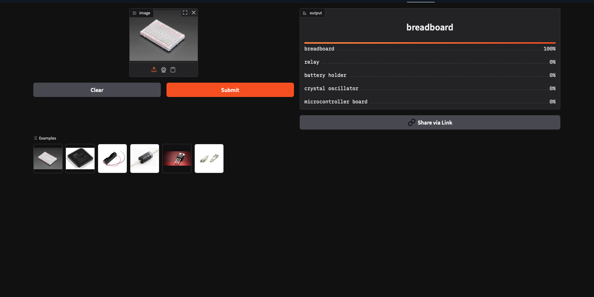

# Electronic Component Recognizer

This project is an end-to-end pipeline for building an image classification system that can recognize and classify electronic components. It covers the entire workflow — from **data collection, data cleaning, training, evaluation, and deployment** to **API integration with a live demo**.

The model is designed to classify **20 different types of commonly used electronic components** in circuits, prototyping, and hardware systems.

### Supported Component Classes

1. Resistor
2. Capacitor
3. Diode
4. Transistor
5. IC Chip
6. Relay
7. Switch
8. Transformer
9. LED
10. Connector
11. Potentiometer
12. Fuse
13. Inductor Coil
14. Crystal Oscillator
15. Heat Sink
16. Breadboard
17. Jumper Wire
18. Battery Holder
19. Power Supply Module
20. Microcontroller Board

---

# 🧾 Dataset Preparation & Model Training

## Dataset Preparation

### 📌 Data Collection

- Scraped **3,686 images** from online sources (mainly **DuckDuckGo Image Search**).
- Used **component-specific search terms** (e.g., _resistor_, _capacitor_, _IC chip_).
- Ensured proper class naming to help the model learn true visual characteristics.

### 🧹 Data Cleaning

- Manually inspected and filtered images using **fastai’s ImageClassifierCleaner**.
- Removed **25 noisy / irrelevant images** (schematics, logos, unrelated objects).
- Final dataset size: **3,661 cleaned images**.
- Cleaning improved accuracy and reduced mislabeled bias.

### ⚙️ DataLoader Setup

- Used **fastai DataBlock API** for:
  - Train/validation split
  - Applying transformations
  - Creating dataloaders for training pipeline

### 🎨 Data Augmentation

- fastai default **GPU-based augmentations** applied:
  - Rotations
  - Zoom
  - Lighting adjustments
  - Flipping (horizontal/vertical)
- Improved model generalization and reduced overfitting.

---

## Training & Data Cleaning

### 🛠️ Model Training

- **ResNet34** convolutional neural network, pre-trained on ImageNet.
- Fine-tuned with multiple epochs and iterative cycles.
- Achieved **97% validation accuracy**, demonstrating robustness and strong generalization.

### 🧹 Iterative Data Cleaning

- Web-scraped dataset contained noisy images (schematics, logos, unrelated objects).
- **fastai ImageClassifierCleaner** used after each training cycle.
- Workflow: **Train → Clean → Retrain**
- Each cycle significantly improved model performance and reduced errors.

---

## 📊 Model Benchmarking

As per project requirements, at least **three models** were trained and compared to evaluate performance and generalization capability.

| Architecture        | Validation Accuracy | Training Time | Epochs | Remarks                          |
| :------------------ | :------------------ | :------------ | :----- | :------------------------------- |
| **ResNet50**        | 83.8%               | ~10 min       | 15     | Baseline model                   |
| **ResNet34**        | **97.0%**           | ~16 min       | 12     | Best overall accuracy            |
| **EfficientNet_B0** | 66.4%               | ~20 min       | 15     | Balanced accuracy and efficiency |

✅ **Conclusion:**  
ResNet34 achieved the best tradeoff between training time and accuracy.  
EfficientNet_B0 also performed competitively, offering slightly better efficiency but requiring more computation.  
 Overall, the experiments demonstrate that increasing model depth and input resolution improves classification performance.

---

**Confusion Matrix**
To evaluate the model’s performance across different component classes, a **confusion matrix** was generated using the validation dataset.  
It provides a visual representation of how well the model distinguishes between various component types.

<p align="center">
  
</p>

✅ **Interpretation:**

- The diagonal cells indicate correctly classified samples.
- Off-diagonal values represent misclassifications between visually similar components (e.g., resistor vs. capacitor).
- A strong diagonal trend shows the model achieved high precision and recall across all classes.

# Model Deployment

Once the model reached satisfactory performance, it was deployed to **Hugging Face Spaces** using **Gradio**.

- Gradio provides an interactive UI where users can upload an image of an electronic component and instantly receive predictions with confidence scores.
- The deployed model can be accessed here: [HuggingFace Space](https://huggingface.co/spaces/mdfaisalahmed025/electronic-component-recognizer).
- Implementation scripts for deployment can be found in the `deployment` folder.

## Interactive Gradio Interface for Component Recognition

<p align="center">
  
</p>

## Deployed Application Web Page

<p align="center">
  
</p>

---

# API Integration with GitHub Pages

To make the model more accessible and user-friendly, the deployed Hugging Face API was integrated into a **GitHub Pages website**.

- The GitHub Pages site allows users to upload an image directly from their browser.
- The image is sent to the Hugging Face API endpoint, which returns predictions that are displayed on the page.
- This provides a clean and interactive frontend for the model without requiring users to install anything locally.

🔗 Live Demo: [Electronic Component Recognizer Website](https://mdfaisalahmed025.github.io/Electronic-Component-Recognizer/)

The website implementation and scripts for API communication can be found in the `docs` and `backend` folder.

---

# Future Work

- Expanding the dataset to include more diverse angles and real-world usage of components.
- Training deeper models like ResNet50 or EfficientNet for improved accuracy.
- Building a mobile-friendly interface for engineers and students to use on-the-go.
- Integrating with hardware learning platforms (e.g., Arduino kits) for real-time recognition.

---

# Conclusion

The **Electronic Component Recognizer** demonstrates the power of transfer learning and end-to-end ML pipelines — from raw data collection to deployment as a usable web application.  
It has applications in **education, prototyping, inventory management, and automated electronic system design**.

This project showcases a practical workflow for turning an idea into a real, user-facing application powered by machine learning.

# Build from source

Follow the steps below to set up and run the **Electronic Component Recognizer** project on your local machine.

## Clone the Repository

````bash
git clone https://github.com/mdfaisalahmed025/Electronic-Component-Recognizer.git
cd Electronic-Component-Recognizer

## Install dependencies

```bash
pip install -U pip
pip install -r requirements.txt


# 📞 Contact / Author

**Project Maintainer:** Md Faisal Ahmed
**Portfolio:** [mdfaisalahmed.online](https://mdfaisalahmed.online/)
**GitHub:** [@mdfaisalahmed025](https://github.com/mdfaisalahmed025)
````
